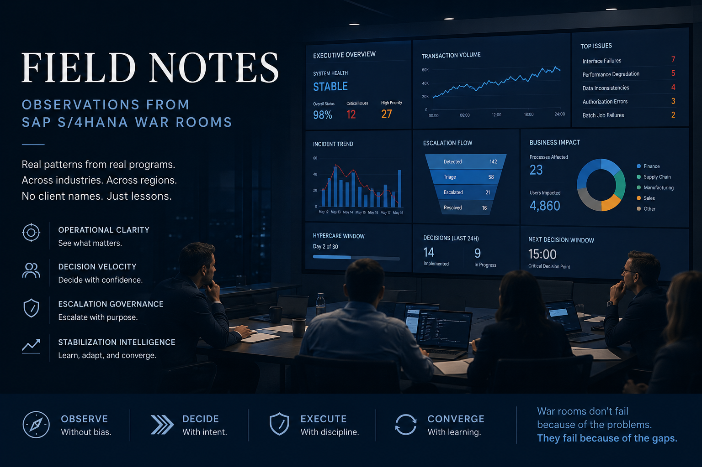

# Field Notes

  

  <em>
    Observations from SAP S/4HANA war rooms, stabilization command centers, escalation governance, and operational convergence during large-scale transformation programs.
  </em>

## Observations from SAP S/4HANA War Rooms

*These notes are drawn from direct program experience across multiple large-scale SAP S/4HANA transformations — global manufacturing, commodities trading, financial services, and regulated industries. No client names are used. The patterns are real.*

---

## On War Rooms

**The war room that runs itself is already failing.**

Every war room has a moment when the noise-to-decision ratio inverts. More discussion. Fewer decisions. The people closest to the problem are too deep in it to see the pattern forming. The people with authority to act are getting their information filtered by three layers of exhausted consultants.

That moment is not a crisis. It is a governance gap that opened weeks earlier, when no one defined what the command center was supposed to *produce* — not just monitor.

---

**Bridge calls solve the wrong problem.**

The instinct after a critical incident is to add people to the bridge. More coverage. More eyes. More escalation paths. What that produces, in practice, is more noise entering an environment already struggling to process the noise it has.

The question is never *who else should be on the call*. The question is *what decision needs to be made in the next fifteen minutes, and who has the authority to make it*.

---

**The first 72 hours after go-live are not hypercare. They are the real go-live.**

Deployment weekend is theater. The real test is what happens Monday morning when the business runs full transaction volume for the first time with no fallback window. The organization that has been managing cutover execution suddenly has to manage operational stabilization — and those are different capabilities.

Most programs do not plan for the transition between them.

---

## On Escalation

**Escalation frequency is not a measure of problem severity. It is a measure of governance failure.**

When escalations arrive at the executive level in rapid succession, the natural interpretation is that the