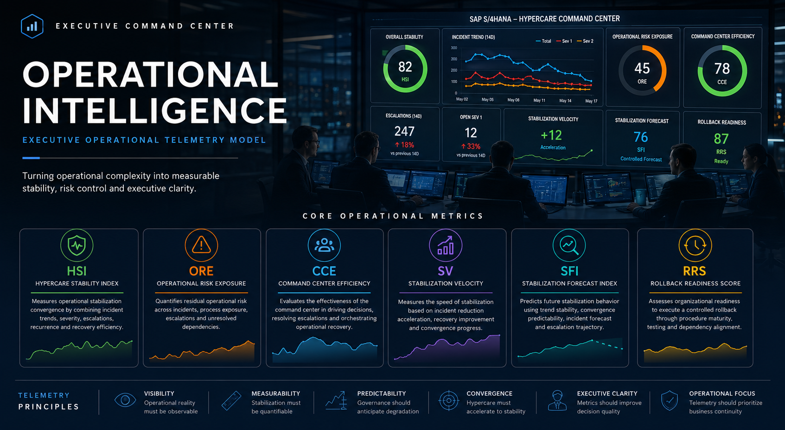

# Metrics Dictionary

<p align="center">
  
</p>

<p align="center">
  <em>
    Operational governance becomes measurable when stabilization, risk and convergence are translated into telemetry.
  </em>
</p>

## Executive Operational Telemetry Model

---

# Purpose

Operational governance is only as good as what it can observe.

That statement sounds obvious. In practice, most SAP programs after go-live are governed by a combination of escalation volume, team perception, and the subjective assessment of whether things feel better or worse than yesterday. None of those are telemetry. None of them produce the kind of measurable, observable signal that allows leadership to make high-quality decisions under pressure.

This document defines the core operational telemetry metrics used throughout the Operational Intelligence capability. They were designed specifically for SAP S/4HANA programs, cutover governance, hypercare operations, and enterprise transformation command centers.

The objective is not to generate more reporting. The objective is to make operational reality observable: stabilization progress measurable, risk exposure visible, convergence quantifiable, and executive decisions grounded in something more reliable than the mood of the most recent war room.

---

# Telemetry Principles

Six principles govern the operational telemetry model. They are not aspirational. They are design constraints that every metric in this framework was built to satisfy.

| Principle | Description |
|---|---|
| Visibility | Operational reality must be observable before it can be managed |
| Measurability | Stabilization must be quantifiable, not estimated |
| Predictability | Governance should anticipate degradation, not react to it |
| Convergence | Hypercare must accelerate toward a defined stable state |
| Executive Clarity | Metrics should improve decision quality, not increase reporting volume |
| Operational Focus | Telemetry should prioritize business continuity above all else |

The distinction between visibility and control is worth noting here. Many governance structures attempt to control operations they cannot observe. That produces noise, not stability. Visibility comes first. Control follows from it.

---

# Core Operational Metrics

| KPI | Description | Operational Domain |
|---|---|---|
| HSI | Hypercare Stability Index | Stabilization |
| ORE | Operational Risk Exposure | Operational Risk |
| CCE | Command Center Efficiency | Governance |
| SV | Stabilization Velocity | Convergence |
| SFI | Stabilization Forecast Index | Predictive Intelligence |
| RRS | Rollback Readiness Score | Recovery Governance |

Each metric addresses a specific governance blind spot that traditional delivery reporting leaves uncovered. Together they form an operational intelligence layer capable of providing the kind of continuous, measurable signal that stabilization management requires.

---

# HSI — Hypercare Stability Index

## What It Is

The Hypercare Stability Index measures operational stabilization convergence after go-live. It answers the question that every executive sponsor asks during hypercare, and that most programs cannot answer with precision: are we actually getting better, or does it just feel that way?

## Executive Purpose

HSI provides leadership with a single, composite signal indicating whether the operational environment is converging toward stability, plateauing at an acceptable but incomplete level of recovery, or actively degrading in ways that require escalation.

The value of a composite index is that it prevents any single input from distorting the overall picture. A week with low incident volume but high severity recurrence looks healthy on a raw count basis. HSI is designed to see through that.

## What It Measures

HSI combines five operational dimensions into a weighted stabilization score:

```text
HSI =
(
  Incident Reduction Trend    × 30%
  Severity Stabilization      × 25%
  Escalation Control          × 20%
  Recovery Efficiency         × 15%
  Recurrence Reduction        × 10%
)
```

The weighting reflects operational reality: incident trend and severity behavior are the most reliable leading indicators of stabilization direction. Recovery efficiency and recurrence reduction matter, but they follow from the upstream drivers.

## Interpretation

| Range | Operational Meaning |
|---|---|
| 90–100 | Stable operational convergence |
| 75–89 | Controlled stabilization |
| 60–74 | Elevated operational pressure |
| Below 60 | Stabilization degradation risk |

## Signals of Deterioration

- Critical incident recurrence increasing despite overall volume decrease
- Escalation growth accelerating rather than declining
- Recovery cycles lengthening week over week
- Business disruption concentrated in the same process areas
- Visible hypercare fatigue affecting team response quality

## Typical Leadership Actions

When HSI declines, the response should be structural rather than reactive. Reinforce command center governance before escalation volume overwhelms it. Identify and escalate cross-functional dependencies that are blocking recovery. Reduce operational bottlenecks by clarifying ownership where it has become ambiguous. Increase monitoring cadence on the specific process areas driving the deterioration.

---

# ORE — Operational Risk Exposure

## What It Is

Operational Risk Exposure measures how exposed the business remains after deployment. It is a risk metric, not a performance metric. Its purpose is not to measure how well stabilization is progressing but how much damage the current state can absorb before business continuity is threatened.

## Executive Purpose

ORE answers a question that HSI does not: even if stabilization is improving, what is the residual risk? An operation can be converging in the right direction while still carrying enough exposure to produce a significant business disruption if the wrong incident occurs at the wrong moment.

Leadership needs both signals. HSI tells you where you are going. ORE tells you how much runway you have.

## What It Measures

```text
ORE =
(
  Critical Incident Weight         × 35%
  Business Process Exposure        × 25%
  Escalation Load                  × 20%
  Operational Dependency Risk      × 20%
)
```

Critical incident weight carries the largest share because Sev1 and Sev2 incidents are the events that actually threaten business continuity. Business process exposure captures the degree to which core processes remain fragile, independent of incident count.

## Interpretation

| Range | Operational Meaning |
|---|---|
| 0–20 | Low operational exposure |
| 21–40 | Controlled operational risk |
| 41–60 | Elevated operational pressure |
| Above 60 | High operational fragility |

## Signals of Deterioration

- Sev1 and Sev2 incident frequency increasing
- Core business processes showing repeated instability
- Dependency chains creating bottlenecks that are not being resolved
- Cross-stream escalation conflicts consuming governance capacity

## Typical Leadership Actions

When ORE is elevated, prioritization has to become explicit and defensible. Not every issue can be treated as equally urgent. High-impact stabilization items must be separated from operational noise and given dedicated resolution paths. Dependency bottlenecks require escalation to the level where they can actually be resolved. Executive risk visibility needs to increase, not because more reporting helps, but because some of the decisions required to reduce ORE can only be made at the executive level.

---

# CCE — Command Center Efficiency

## What It Is

Command Center Efficiency measures whether the war room is functioning as an operational intelligence structure or as an escalation meeting with a different name.

That distinction matters more than it might appear. Both structures consume similar amounts of time and energy. They produce very different outcomes.

## Executive Purpose

CCE gives leadership a measurable signal on the quality of the governance structure itself. Low CCE is not primarily an indicator of operational problems. It is an indicator of governance problems that will produce operational problems if not addressed.

## What It Measures

```text
CCE =
(
  Decision Cycle Efficiency      × 30%
  Escalation Resolution Rate     × 30%
  Cross-Team Coordination        × 20%
  Operational Throughput         × 20%
)
```

Decision cycle efficiency and escalation resolution rate share the largest weights because they are the most direct measures of whether the command center is actually making things happen or merely discussing them.

## Interpretation

| Range | Operational Meaning |
|---|---|
| 90–100 | Highly efficient command structure |
| 75–89 | Controlled operational governance |
| 60–74 | Coordination inefficiencies emerging |
| Below 60 | Escalation-driven operational chaos |

## Signals of Deterioration

- Escalation volume growing faster than resolution rate
- Decision cycles extending across multiple sessions without closure
- The same issues appearing repeatedly without progress
- Cross-functional coordination failures becoming routine

## Typical Leadership Actions

When CCE deteriorates, the instinct is often to add more governance: more meetings, more reporting, more escalation paths. That instinct is usually wrong. The correct response is simplification. Reduce escalation complexity. Clarify ownership models so that decisions land with people who can actually make them. Reduce communication fragmentation. Improve the quality of information available in the command center so that discussions can reach decisions rather than deferring them.

---

# SV — Stabilization Velocity

## What It Is

Stabilization Velocity measures the rate at which the operational environment is moving toward stability. It is the first derivative of stabilization progress: not where you are, but how fast you are getting there, and whether that speed is increasing or decreasing.

## Executive Purpose

SV answers the question that matters most for hypercare planning: at the current rate of improvement, when does stabilization reach an acceptable threshold? Without velocity data, that question can only be answered with optimism or anxiety. Neither is useful.

## What It Measures

```text
SV =
(
  Incident Reduction Acceleration   × 40%
  Recovery Trend Improvement        × 30%
  Operational Convergence           × 30%
)
```

Incident reduction acceleration carries the highest weight because it is the most sensitive early indicator of whether stabilization is gaining momentum or losing it.

## Interpretation

| Signal | Operational Meaning |
|---|---|
| Positive acceleration | Stabilization improving |
| Stable trend | Controlled convergence |
| Negative trend | Stabilization slowdown |
| Sharp decline | Operational degradation risk |

## Signals of Deterioration

- Incident reduction rate plateauing before acceptable stability threshold is reached
- Recurring operational instability in the same process areas despite remediation efforts
- Support dependency increasing rather than transferring to business teams
- Hypercare extension risk becoming probable based on current trajectory

## Typical Leadership Actions

When SV slows, the first question is whether the slowdown reflects a natural plateau in the stabilization curve or a structural bottleneck preventing further progress. The answer determines the response. Natural plateaus require patience and continued monitoring. Structural bottlenecks require active intervention: identifying recurring incident patterns, accelerating ownership transfer to operational teams, and addressing the dependencies preventing convergence from continuing.

---

# SFI — Stabilization Forecast Index

## What It Is

The Stabilization Forecast Index translates current operational telemetry into a predictive signal about future stabilization behavior. It is the closest this framework comes to answering the question every executive sponsor eventually asks: when will this be over?

## Executive Purpose

SFI provides predictive visibility into stabilization trajectory. It does not produce certainty. No index does. What it produces is a probability-weighted assessment of whether current trends, if they continue, will lead to stable operations within a defined window, or whether the trajectory suggests hypercare extension is likely.

That signal, delivered early enough, allows leadership to make proactive decisions rather than reactive ones.

## What It Measures

```text
SFI =
(
  Trend Stability               × 35%
  Convergence Predictability    × 25%
  Incident Forecast Trend       × 20%
  Escalation Forecast           × 20%
)
```

## Interpretation

| Range | Operational Meaning |
|---|---|
| 85–100 | Stable projected convergence |
| 70–84 | Controlled stabilization forecast |
| 50–69 | Elevated stabilization uncertainty |
| Below 50 | High probability of hypercare extension |

## Signals of Deterioration

- Forecast instability increasing rather than narrowing
- Escalation trend accelerating rather than decelerating
- Convergence rate slowing without identifiable cause
- Recovery inconsistency making trend projection unreliable

## Typical Leadership Actions

When SFI drops below 70, the response should be proactive rather than reactive. Increase predictive monitoring cadence. Escalate stabilization planning reviews to include executive-level discussion of scenarios and contingencies. Reassess operational recovery assumptions that were made before go-live against the reality that has emerged since. If SFI drops below 50, the probability of hypercare extension is high enough that it should be communicated to stakeholders rather than managed as an internal concern.

---

# RRS — Rollback Readiness Score

## What It Is

Rollback Readiness Score measures whether the organization retains the capability to execute a controlled rollback if the operational situation requires it. It is not a measure of likelihood. Most programs never execute a rollback. It is a measure of optionality: whether leadership has a viable course of action available if the primary path becomes untenable.

## Executive Purpose

RRS addresses one of the least discussed governance failures in large SAP programs: the gradual erosion of rollback viability as time passes after go-live. Documentation becomes stale. Recovery procedures go unvalidated. Dependencies shift. The team members who understood the rollback plan move to other priorities.

When a rollback is needed, it is needed under extreme pressure with no time for preparation. RRS ensures that preparation happened before the pressure arrived.

## What It Measures

```text
RRS =
(
  Rollback Procedure Completeness        × 30%
  Recovery Validation Coverage           × 25%
  Dependency Readiness                   × 20%
  Operational Coordination Preparedness  × 25%
)
```

## Interpretation

| Range | Operational Meaning |
|---|---|
| 90–100 | Rollback execution fully viable |
| 75–89 | Controlled rollback readiness |
| 60–74 | Partial rollback exposure |
| Below 60 | Significant rollback execution risk |

## Signals of Deterioration

- Rollback procedures not validated since go-live
- Dependency mapping not updated to reflect post-go-live changes
- Recovery testing incomplete or conducted under unrealistic conditions
- Ownership of rollback execution ambiguous or distributed without clear accountability

## Typical Leadership Actions

Validate rollback orchestration against current system state, not the state that existed at cutover. Reassess dependency mapping with fresh eyes from teams that have been operating the system post go-live. Conduct recovery simulations under realistic time pressure. Clarify technical readiness and ensure the team capable of executing the rollback is still identifiable, available, and informed.

---

# Final Observation

Traditional project reporting was designed to answer one question: is the project on track?

That question matters during delivery. It stops mattering the moment the system goes live.

After go-live, the questions that matter are different: is the operation stabilizing? How fast? What is the residual risk? Is the governance structure working? What does the trajectory suggest about the next thirty days?

Those questions require a different instrument set. Operational telemetry is that instrument set.

The future of SAP operational governance depends on the ability to translate operational reality into measurable intelligence: not to produce reports, but to produce decisions. Faster, better-grounded, and earlier than the alternative.

Because governance that cannot observe operational reality is not governance. It is hope with a status report attached.