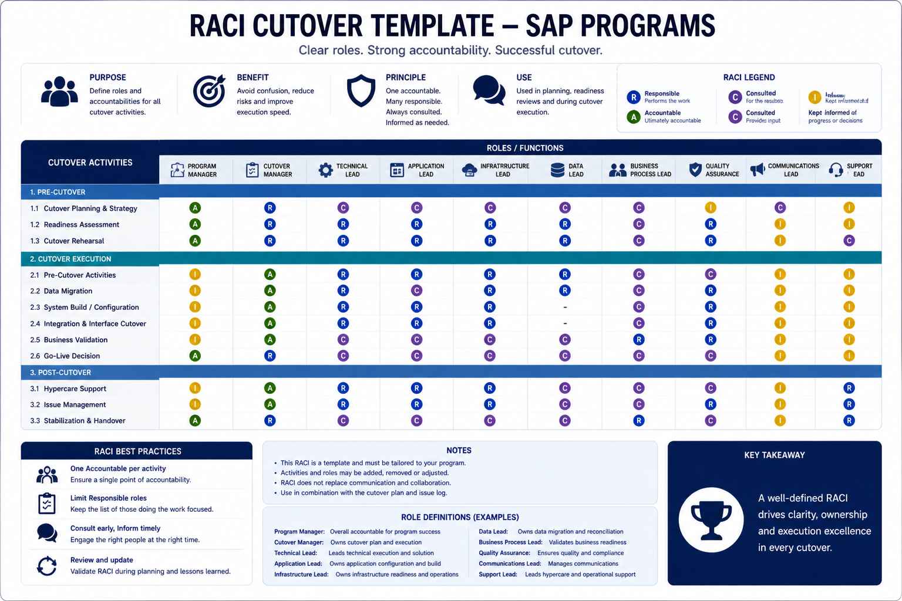

# RACI Matrix — SAP S/4HANA Cutover

## 🧩 RACI Cutover Template

*Figure: RACI matrix for SAP cutover execution — defining clear roles, accountability, and governance across all workstreams.*

A RACI matrix for cutover is not a project RACI. The roles, the decisions, and the accountability structure during the cutover window are different from normal program governance — and treating them as the same is a common source of confusion during execution.

This matrix covers the cutover window specifically: from system freeze through go-live declaration and hypercare activation. It is designed to be adapted to your program's specific roles and org structure — not applied verbatim.

**R** = Responsible (does the work)
**A** = Accountable (owns the outcome — one person per activity)
**C** = Consulted (input required before decision)
**I** = Informed (notified of outcome)

---

## Roles reference

| Role | Description |
|:---|:---|
| **CL** | Cutover Lead — single point of authority during the window |
| **EL** | Execution Lead — manages task sequencing and critical path |
| **BAS** | SAP Basis Lead — technical ownership of SAP environments |
| **INT** | Integration Lead — owns interface layer and middleware |
| **DM** | Data Migration Lead — owns migration jobs and reconciliation |
| **FL-FI** | Functional Lead — Finance (FI/CO) |
| **FL-MM** | Functional Lead — Supply Chain (MM/SD/WM/EWM) |
| **FL-HR** | Functional Lead — HR (HCM/SuccessFactors) |
| **FL-PP** | Functional Lead — Production Planning (PP/QM/PM) |
| **BR** | Business Representative — domain sign-off authority |
| **IM** | Incident Manager — owns issue log and escalation tracking |
| **SC** | SteerCo / Executive Sponsor — final escalation authority |
| **RL** | Regional Lead — regional execution authority (multi-region programs) |

---

## 1. Pre-cutover preparation

| Activity | CL | EL | BAS | INT | DM | FL | BR | IM | SC |
|:---|:---:|:---:|:---:|:---:|:---:|:---:|:---:|:---:|:---:|
| Confirm cutover plan is baselined and distributed | A | R | C | C | C | C | I | I | I |
| Confirm all roles and contacts for war room | A | R | C | C | C | C | C | C | I |
| Confirm rollback criteria and decision authority | A | C | C | C | C | I | I | I | C |
| Confirm Go/No-Go criteria and evidence requirements | A | C | C | C | C | C | C | I | C |
| Validate transport queue (T-48h) | I | C | A/R | I | I | C | I | I | I |
| Validate data migration dress rehearsal results | C | C | I | I | A/R | C | C | I | I |
| Confirm integration test sign-off | C | C | I | A/R | I | C | C | I | I |
| Confirm business validation scope with BR | C | I | I | I | I | C | A/R | I | I |
| Activate war room channels and confirm access | I | A/R | C | C | C | C | C | C | I |
| Distribute communication templates to owners | A | R | I | I | I | I | I | I | I |
| Send system freeze notification | A | I | I | I | I | I | R | I | I |

---

## 2. System freeze and downtime window opening

| Activity | CL | EL | BAS | INT | DM | FL | BR | IM | SC |
|:---|:---:|:---:|:---:|:---:|:---:|:---:|:---:|:---:|:---:|
| Confirm system freeze effective | C | C | A/R | I | I | I | I | I | I |
| Final Go/No-Go assessment | A | C | C | C | C | C | C | I | C |
| Go/No-Go decision | A | I | I | I | I | I | I | I | C |
| Send downtime window notification | A | I | I | I | I | I | R | I | I |
| Open war room — confirm all leads present | A | R | C | C | C | C | I | C | I |
| Confirm incident log active and accessible | I | C | I | I | I | I | I | A/R | I |
| Initiate backup (pre-cutover snapshot) | C | C | A/R | I | I | I | I | I | I |
| Confirm backup complete before proceeding | A | C | R | I | I | I | I | I | I |

---

## 3. Technical execution

| Activity | CL | EL | BAS | INT | DM | FL | BR | IM | SC |
|:---|:---:|:---:|:---:|:---:|:---:|:---:|:---:|:---:|:---:|
| Execute transport imports | I | C | A/R | I | I | I | I | I | I |
| Monitor transport queue progress | I | C | A/R | I | I | I | I | R | I |
| Confirm transport consistency | C | C | A/R | I | I | C | I | I | I |
| Execute system conversion / upgrade steps | I | C | A/R | I | I | I | I | I | I |
| Confirm technical go/no-go (post-conversion) | C | C | A/R | C | C | I | I | I | I |
| Activate interfaces (sequence by dependency) | C | C | I | A/R | I | I | I | R | I |
| Confirm interface activation — per system | I | C | I | A/R | I | I | I | R | I |
| Confirm end-to-end integration message flow | C | C | I | A/R | I | C | I | R | I |
| Execute background job scheduling | I | C | A/R | I | I | I | I | I | I |
| Confirm authorization profiles active | I | C | A/R | I | I | C | I | I | I |
| Confirm output determination active | I | C | I | I | I | A/R | I | I | I |

---

## 4. Data migration execution

| Activity | CL | EL | BAS | INT | DM | FL | BR | IM | SC |
|:---|:---:|:---:|:---:|:---:|:---:|:---:|:---:|:---:|:---:|
| Confirm environment ready for migration | C | C | R | I | A | I | I | I | I |
| Execute master data migration jobs | I | C | C | I | A/R | I | I | R | I |
| Execute transactional data migration jobs | I | C | C | I | A/R | I | I | R | I |
| Monitor migration job progress vs. plan | I | C | I | I | A/R | I | I | R | I |
| Escalate job overrun (>buffer threshold) | I | C | I | I | A/R | I | I | R | I |
| Execute reconciliation — technical | I | I | I | I | A/R | C | I | R | I |
| Execute reconciliation — business validation | I | I | I | I | C | C | A/R | R | I |
| Resolve reconciliation discrepancy | C | C | I | I | R | C | A | R | I |
| Classify discrepancy: blocking vs. non-blocking | A | C | I | I | C | C | C | I | I |
| Data migration sign-off (technical) | C | C | I | I | A/R | I | I | I | I |
| Data migration sign-off (business) | C | I | I | I | C | C | A/R | I | I |

---

## 5. Functional validation and smoke testing

| Activity | CL | EL | BAS | INT | DM | FL | BR | IM | SC |
|:---|:---:|:---:|:---:|:---:|:---:|:---:|:---:|:---:|:---:|
| Confirm data migration sign-off before smoke tests | A | R | I | I | C | I | I | I | I |
| Execute FI/CO smoke tests | I | I | I | I | I | A/R | C | R | I |
| Execute MM/SD smoke tests | I | I | I | I | I | A/R | C | R | I |
| Execute PP/QM/PM smoke tests | I | I | I | I | I | A/R | C | R | I |
| Execute HR smoke tests | I | I | I | I | I | A/R | C | R | I |
| Execute end-to-end integration smoke tests | I | C | I | R | I | C | C | R | I |
| Triage failed smoke test | C | C | I | C | C | A/R | C | R | I |
| Classify failed test: blocking vs. non-blocking | A | C | C | C | C | C | C | I | I |
| Accept workaround for non-blocking failure | A | C | I | I | I | C | C | I | C |
| Functional sign-off — per module | C | C | I | I | I | A/R | C | I | I |
| Business sign-off — per domain | C | I | I | I | I | C | A/R | I | I |

---

## 6. Go-live decision

| Activity | CL | EL | BAS | INT | DM | FL | BR | IM | SC |
|:---|:---:|:---:|:---:|:---:|:---:|:---:|:---:|:---:|:---:|
| Confirm Basis technical sign-off | C | C | A/R | I | I | I | I | I | I |
| Confirm integration sign-off | C | C | I | A/R | I | I | I | I | I |
| Confirm data migration sign-off (all objects) | C | C | I | I | A/R | I | I | I | I |
| Confirm functional sign-off (all modules) | C | C | I | I | I | A/R | I | I | I |
| Confirm business sign-off (all domains) | C | I | I | I | I | C | A/R | I | I |
| Review open incident register | A | C | I | I | I | I | I | R | I |
| Go-live decision | A | I | I | I | I | I | I | I | C |
| Send go-live declaration | A | I | I | I | I | I | R | I | I |
| Notify SteerCo — go-live confirmed | A | I | I | I | I | I | I | I | R |

---

## 7. Rollback decision (if triggered)

| Activity | CL | EL | BAS | INT | DM | FL | BR | IM | SC |
|:---|:---:|:---:|:---:|:---:|:---:|:---:|:---:|:---:|:---:|
| Identify rollback trigger condition | R | R | C | C | C | C | I | R | I |
| Assess rollback feasibility vs. push-through | A | C | C | C | C | C | C | I | C |
| Rollback decision | A | I | I | I | I | I | I | I | C |
| Execute rollback procedure | C | R | A/R | R | R | I | I | R | I |
| Confirm system restored to pre-cutover state | C | C | A/R | C | C | I | I | R | I |
| Send rollback notification to stakeholders | A | I | I | I | I | I | R | I | I |
| Initiate root cause analysis | A | R | C | C | C | C | I | R | I |
| Communicate revised go-live timeline | A | I | I | I | I | I | R | I | R |

---

## 8. Hypercare activation

| Activity | CL | EL | BAS | INT | DM | FL | BR | IM | SC |
|:---|:---:|:---:|:---:|:---:|:---:|:---:|:---:|:---:|:---:|
| War room stand-down — confirm go-live stable | A | R | C | C | C | C | I | I | I |
| Hypercare team briefing — incoming shift | A | R | C | C | C | C | I | R | I |
| Handoff: open incidents from war room to hypercare | R | R | C | C | C | C | I | A/R | I |
| Handoff: active workarounds and residual risks | R | R | C | C | C | C | I | A/R | I |
| Send hypercare activation notice | A | I | I | I | I | I | R | I | I |
| Activate support channels (ServiceNow / queue) | I | I | A/R | I | I | I | I | C | I |
| Publish first hypercare status report | A | I | I | I | I | I | I | R | I |
| Confirm hypercare SLA model active | A | I | I | I | I | I | C | R | I |

---

## 9. Multi-region additions

For programs with regional execution leads, add the **RL** column to the relevant sections:

| Activity | CL | RL | Notes |
|:---|:---:|:---:|:---|
| Regional execution within defined parameters | I | A/R | RL owns regional critical path |
| Regional incident escalation to global war room | C | R | RL escalates — CL decides if cross-region impact |
| Regional go-live readiness confirmation | A | R | RL confirms — CL acknowledges |
| Regional rollback decision | A | C | CL decides — RL executes |
| Follow-the-sun handoff execution | C | A/R | RL owns handoff briefing in their region |
| Regional hypercare lead assignment | A | R | RL nominates — CL confirms |

---

## Adaptation guide

**Before using this matrix:**

1. Replace role abbreviations with actual names — during execution, people respond to names, not abbreviations
2. Review every "A" — there must be exactly one accountable person per activity. Two names in the same "A" cell means the accountability is unresolved
3. Add program-specific activities — regulatory validation gates, third-party system sign-offs, country-specific requirements
4. Remove rows that do not apply — a RACI with irrelevant rows is noise that dilutes the rows that matter
5. Confirm with each role holder that they understand and accept their accountabilities before the window opens — a RACI that was never reviewed is not a RACI, it is a document

**The two most important cells in this matrix:**

The "A" for the go-live decision (Section 6) and the rollback decision (Section 7). Everything else in the matrix exists to prepare the inputs for those two decisions. If the accountabilities for those two rows are unclear going into the window, nothing else in the matrix matters.

